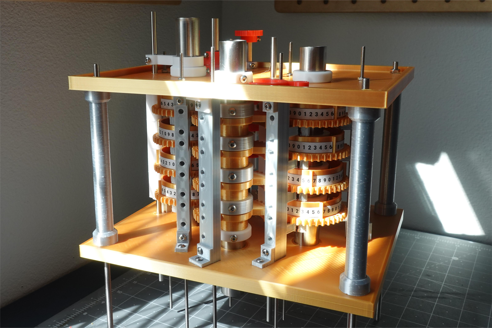

# 3D Printed Difference Engine
A project that aims to reproduce difference engine via (mostly) 3D printed parts

## What is the difference engine
> A difference engine is an automatic mechanical calculator designed to tabulate polynomial functions. It was designed in the 1820s, and was first created by Charles Babbage. The name difference engine is derived from the method of divided differences, a way to interpolate or tabulate functions by using a small set of polynomial co-efficients. Some of the most common mathematical functions used in engineering, science and navigation, are built from logarithmic and trigonometric functions, which can be approximated by polynomials, so a difference engine can compute many useful tables. (From Wikepedia)

## What is this project

This repo tracks my (Mech. RedPanda) progress for making a replica of the different engine No.2 using 3D printing. So far, I've successfully created a trial piece with 8 figure wheels, which can support calculating linear functions.

You can find the machine in action here: https://youtu.be/1D7sgLyiGqM

